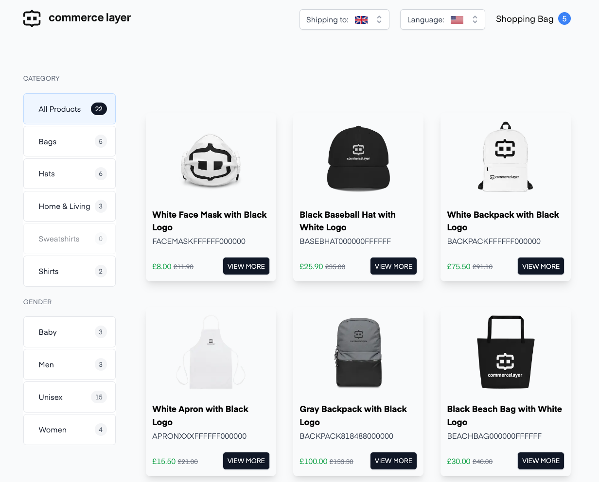
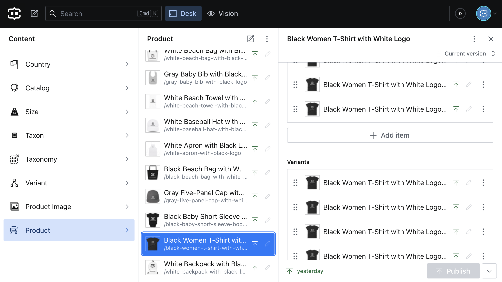
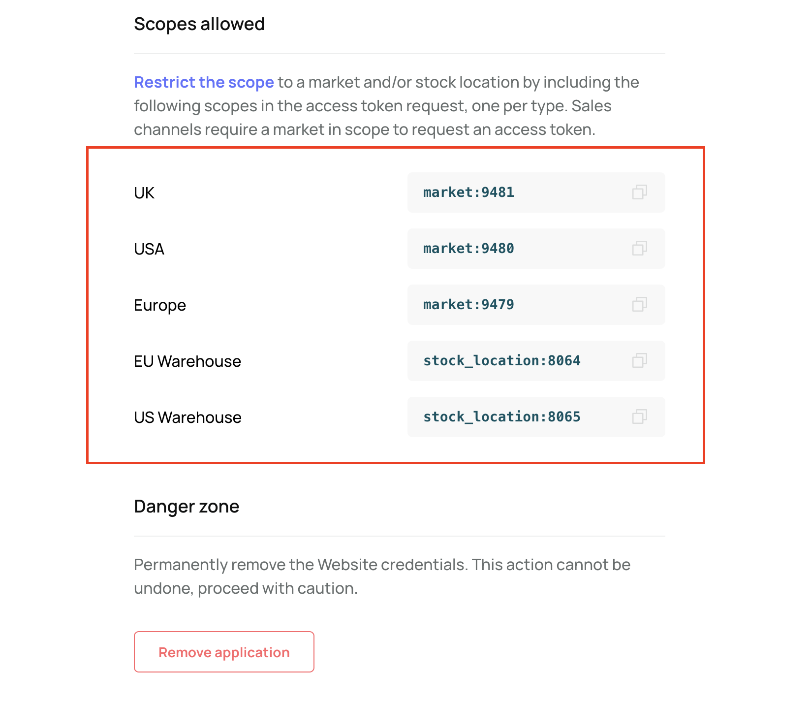
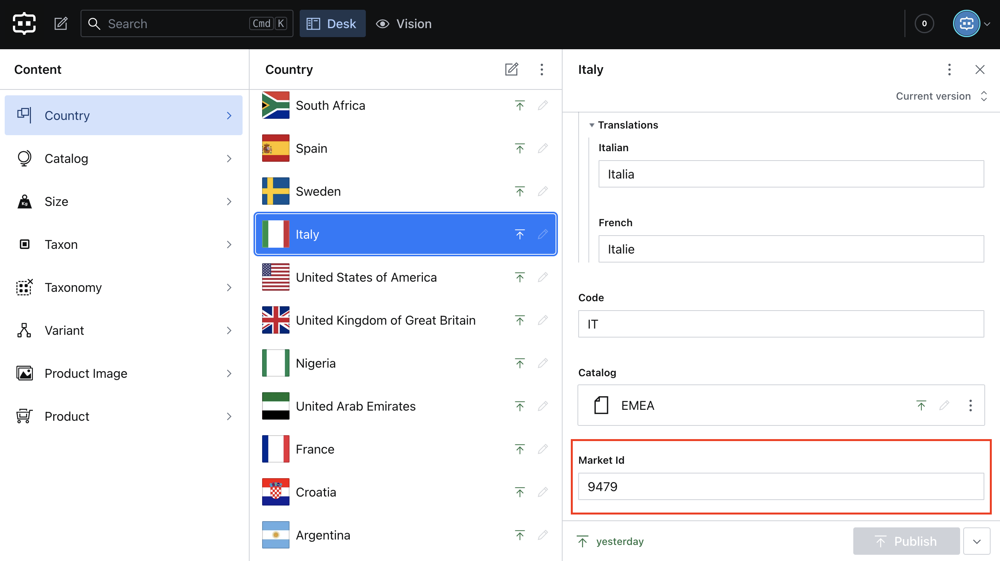

# Commerce Layer Sanity Template

[](https://github.com/commercelayer/commercelayer-sanity-template/actions/workflows/release.yml) [](https://app.netlify.com/sites/commercelayer-sanity-template/deploys)

A multi-country ecommerce template built with Commerce Layer, Next.js, Sanity studio, and deployed to Netlify.

[](https://commercelayer-sanity-template.netlify.app)

## What is Commerce Layer?

[Commerce Layer](https://commercelayer.io) is a multi-market commerce API and order management system that lets you add global shopping capabilities to any website, mobile app, chatbot, wearable, voice, or IoT device, with ease. Compose your stack with the best-of-breed tools you already mastered and love. Make any experience shoppable, anywhere, through a blazing-fast, enterprise-grade, and secure API.

## Table of Contents

- [Template Features](#template-features)
- [Getting Started](#getting-started)
  - [Installation Guide](#installation-guide)
  - [Import Seed Commerce Layer Data](#import-seed-commerce-layer-data)
  - [Import Seed Sanity Studio Content](#import-seed-sanity-studio-content)
- [Contributors Guide](#contributors-guide)
- [Need Help?](#need-help)
- [License](#license)

---

## Template Features

- A user-friendly and performant ecommerce storefront (with products, categories, i18n, cart, checkout, etc.) built with TypeScript, Nextjs, [Commerce Layer React Components](https://github.com/commercelayer/commercelayer-react-components) library, and Tailwind CSS.
- International transactional functionalities powered by [Commerce Layer](https://commercelayer.io) APIs.
- Structured content and a customizable Sanity authoring environment (including demo data), accessible on `<yourdomain>/studio`.
- PSD2-compliant and production-ready checkout functionality powered by [Commerce Layer React Checkout](https://github.com/commercelayer/commercelayer-react-checkout) application.
- Commerce seed data powered by [Commerce Layer CLI Seeder](https://github.com/commercelayer/commercelayer-cli-plugin-seeder/blob/main/README.md) plugin.
- React18 and Next13 support.
- Type-checking and code linting.
- Localization support (including Italian and French translations).
- SEO and progressive web application (PWA) support.
- Comprehensive installation and usage documentation.
- One-click deployment configuration to Netlify.

| [Storefront](https://commercelayer-sanity-template.netlify.app) (`/` page) | [Sanity studio](https://commercelayer-sanity-template.netlify.app/studio) (`/studio` page)                                                                |
| ----------------------------------------- | ------------------------------ |
| [](https://commercelayer-sanity-template.netlify.app)          | [](https://commercelayer-sanity-template.netlify.app/studio)                   |

## Important Files and Folders

| **Path**                           | **Description**                      |
| ---------------------------------- | ------------------------------------ |
| `.env.local.sample`                | Example file with all the required environment variables.                                                      |  
| `/components`                      | React components for the storefront. | 
| `/locale/index.ts`                 | Config file for the storefront's transalations (`en-US`, `it-IT`, and `fr-FR`).                              |
| `/hooks/GetToken.ts`               | Hooks file to fetch a salesChannel token from Commerce Layer and save as a cookie.                             |
| `/pages/[countryCode]/[lang]/index.tsx`     | Index page for the storefront (country selector and product listing).                                    |
| `/pages/[countryCode]/[lang]/[product].tsx` | Page for all product items (image, product information, and variant selection).                        |
| `/data`                            | Exported data to seed your Sanity studio with.                                                                |  
| `/utils/sanity/api.ts`             | Where all data from Sanity is fetched using `groq` queries.                                                       |
| `sanity.config.ts`                 | Config file for Sanity Studio.                                                                     |
| `sanity.cli.ts`                    | Config file for Sanity CLI.                                                                        |
| `/pages/studio/[[...index]].tsx`   | Where Sanity Studio is mounted using `next-sanity`.                                                              |
| `/schemas`                         | Where Sanity Studio gets its content types from.                                                                 |
| `/plugins`                         | Where the advanced Sanity Studio customization is setup.                                                     |

## Getting Started

The quickest way to get up and running is to use the deploy button below to set up and deploy automatically to Netlify. Afterward, you will add some seed data to Commerce Layer and Sanity studio. The deploy button will clone this repository and ask you to enter all the required environment variables. Alternatively, you can clone this repository, configure the template, import the dataset into your Sanity studio, import some seed commerce data into your Commerce Layer organization, and deploy your application. The installation guides below will show you how to achieve this.

[](https://app.netlify.com/start/deploy?repository=https://github.com/commercelayer/commercelayer-sanity-template#BUILD_LANGUAGES=en-US,it-IT,fr-FR&BUILD_CMS=sanity)

### Installation Guide

1. Clone this repository ([learn how to do this](https://docs.github.com/en/github/creating-cloning-and-archiving-repositories/cloning-a-repository)).

2. Rename the `/env.local.example` file to `.env.local` and add the following credentials:

| **Variable**                         | **Description**                     |
| ------------------------------------ | ----------------------------------- |
| `BUILD_LANGUAGES`                    | The supported locales (the default is `en-US, it-IT, fr-FR`).                                                       |
| `BUILD_CMS`                          | The name of the CMS in use (the default is `sanity`).                                                        |
| `NEXT_PUBLIC_SITE_NAME`              | Optional name for the `<title>` head tag (you can also edit this directly in the code).                           |
| `NEXT_PUBLIC_SITE_URL`               | Optional URL of your deployed project for the `og:url` meta property (you can also edit this directly in the code).|
| `CL_CLIENT_ID`                       | Your Commerce Layer sales channels application client ID (you can create this automatically by following this [onboarding guide](https://docs.commercelayer.io/developers) or manually on the [Commerce Layer dashboard](https://dashboard.commercelayer.io).          |
| `CL_ENDPOINT`                        | Your Commerce Layer organization's base endpoint (you can copy this on the [Commerce Layer dashboard](https://dashboard.commercelayer.io).                                                 |
| `NEXT_PUBLIC_SANITY_PROJECT_TITLE`   | Optional name for the `<title>` head tag in Sanity studio (you can also edit this directly in the code).          |
| `NEXT_PUBLIC_SANITY_PROJECT_ID`      | Sanity project ID (you can get this from [sanity.io/manage](https://sanity.io/manage).                           |
| `NEXT_PUBLIC_SANITY_DATASET`         | Sanity dataset (you can get this from [sanity.io/manage](https://sanity.io/manage).                                |
| `NEXT_PUBLIC_SANITY_API_VERSION`     | Sanity API version in the ISO date format, e.g `2022-02-15` (you can learn more about this in [Sanity docs](https://www.sanity.io/help/js-client-api-version)).                         |
| `NEXT_PUBLIC_SANITY_TOKEN`           | Sanity API token (you can get this from [sanity.io/manage](https://sanity.io/manage).                           |

3. Run the command below to install the required dependencies:

```bash
npm install
```

4. Run the command below to start the development server:

```bash
npm run dev
```

This will run the storefront at `localhost:3000` and studio at `localhost:3000/studio`.

### Import Seed Commerce Layer Data

1. Create a free [Commerce Layer account](https://dashboard.commercelayer.io/sign_up). If you already have an active account, kindly skip to Step 3.

2. Create a new [organization](https://commercelayer.io/docs/data-model/users-and-organizations) or follow the [onboarding tutorial guide](https://docs.commercelayer.io/developers).

3. Create a new **Integrations** application with **Name** set to `CLI` and **Role** set to `admin`.

4. In your newly created application, copy the `Client ID`, `Client secret`, and `Base endpoint` credentials.

5. Install the [Commerce Layer CLI](https://github.com/commercelayer/commercelayer-cli) which is available as an [npm package](https://www.npmjs.com/package/@commercelayer/commercelayer-cli) or [yarn package](https://yarnpkg.com/package/@commercelayer/cli) using the command below:

```bash
//npm
npm install -g @commercelayer/cli

//yarn
yarn global add @commercelayer/cli
```

6. Log into your application via the CLI using the previously created CLI credentials like so:

```bash
cl applications:login -o <organizationSlug> -i <clientId> -s <clientSecret> -a <applicationAlias>
```

7. Install the [seeder plugin](https://github.com/commercelayer/commercelayer-cli-plugin-seeder/blob/main/README.md) using the command below:

```bash
cl plugins:install seeder
```

8. Run the command below to import three demo [markets](https://data.commercelayer.app/seed/markets.json) (UK, USA, and Europe), a set of [SKUs](https://data.commercelayer.app/seed/skus.json), related [price lists](https://data.commercelayer.app/seed/price_lists.json), related [prices](https://data.commercelayer.app/seed/prices.json), [stock locations](https://data.commercelayer.app/seed/stock_locations.json), and [inventory](https://data.commercelayer.app/seed/stock_items.json) into your organization using the `multi_market` [business model](https://commercelayer.io/docs/data-model/markets-and-business-models).

```bash
cl seed -b multi_market
```

9. To see the commands for other seeder options, type the command below:

```bash
cl --help
```

### Import Seed Sanity Studio Content

Kindly follow the steps below to add the dataset the template was developed with (structured text and image files for all Sanity schema documents). This data will match the commerce data in Commerce Layer (SKUs, prices, etc.).

1. Extract the `production.tar.gz` file in the `/data` directory using the command below:

```bash
tar -xf ./data/production.tar.gz
```

The extracted folder name should look like `production-export-2021-02-26t14-15-56-557z`.

2. Run the command below to import the `data.ndjson` file in the extracted folder.

```bash
sanity dataset import ./data/<name of extracted folder>/data.ndjson <your_dataset>
```

3. Check the Sanity studio now on `localhost:3000/studio` to preview the imported content.

<br />

> **Note**
>
> The Sanity content data includes a collection of sample countries, products, variants, sizes, taxons, taxonomies, catalogs, and product images created during development. To get an [access token](https://docs.commercelayer.io/developers/authentication) for the Nextjs storefront, we fetch the scope (market ID) from the `Market Id` attribute set in the Sanity `country` document schema.
>
> So, when you seed your Commerce Layer organization, some markets will be created with a different market ID from the one imported into Sanity. Hence, you will need to fetch the valid market scope's number (4 digits) from the sales channel tab of your organization in the [Commerce Layer dashboard](https://dashboard.commercelayer.io) and update the appropriate country model in Sanity. For example, the Europe Market on Commerce Layer and Italy country model on Sanity. Failure to do this will result in an invalid scope authentication error when you try to access the storefront.

| Commerce Layer dashboard (sales channel tab) | Sanity studio (country model schema) |
| ---- | ---- |
|  |  |

> **Warning**
>
> You must access the application using the right locale slug for the country you have configured (e.g., `localhost:3000/it/it-it` or `localhost:3000/us/en-us`). Currently, Italy and France are the only countries with a default language different from `en-us`. Hence their slug is `localhost:3000/it/it-it` and `localhost:3000/fr/fr-fr`. Other countries will have the `en-us` slug (e.g., `localhost:3000/ng/en-us`). If you want to set up other countries, then create a market for it on Commerce Layer alongside the associated resources and update the Market ID on Sanity, as mentioned earlier.

Eventually, you would want to add your content data and set up Commerce Layer manually based on your use case. To ensure the template runs smoothly, kindly create a [market](https://docs.commercelayer.io/core/v/api-reference/markets) associated with a [stock location](https://docs.commercelayer.io/core/v/api-reference/stock_locations), [stock item](https://docs.commercelayer.io/core/v/api-reference/stock_items), [price list](https://docs.commercelayer.io/core/v/api-reference/price_lists), [price](https://docs.commercelayer.io/core/v/api-reference/prices), and [SKU](https://docs.commercelayer.io/core/v/api-reference/skus) in Commerce Layer and update the `market ID` attribute, create a product, and link to variant(s) on Sanity. If you want to learn more about how Commerce Layer works, see our [onboarding guide](https://docs.commercelayer.io/core/welcome/onboarding-tutorial), [manual configuration guide](https://docs.commercelayer.io/core/welcome/manual-configuration), or [data models documentation](https://commercelayer.io/docs/data-model).

## Contributors Guide

1. Fork [this repository](https://github.com/commercelayer/commercelayer-sanity-template) (learn how to do this [here](https://help.github.com/articles/fork-a-repo)).

2. Clone the forked repository like so:

```bash
git clone https://github.com/<your username>/commercelayer-sanity-template.git && cd commercelayer-sanity-template
```

3. Make your changes and create a pull request ([learn how to do this](https://docs.github.com/en/github/collaborating-with-issues-and-pull-requests/creating-a-pull-request)).

4. Someone will attend to your pull request and provide some feedback.

## Need Help?

1. Join [Commerce Layer's Slack community](https://slack.commercelayer.app).

2. Create an [issue](https://github.com/commercelayer/sanity-template-commercelayer/issues) in this repository.

3. Ping us [on Twitter](https://twitter.com/commercelayer).

## License

This repository is published under the [MIT](LICENSE) license.

---

Want to learn more about how we built this template  (the first version) and how you can build yours? Then you should read [this article](https://commercelayer.io/blog/how-to-build-an-international-ecommerce-website-with-sanity-and-commerce-layer) on our blog.
