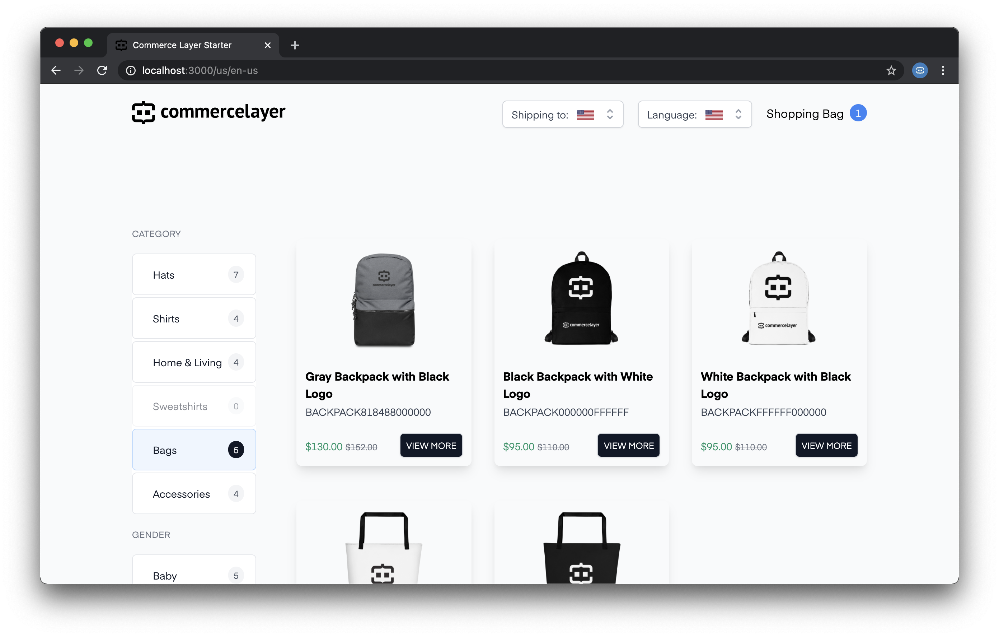
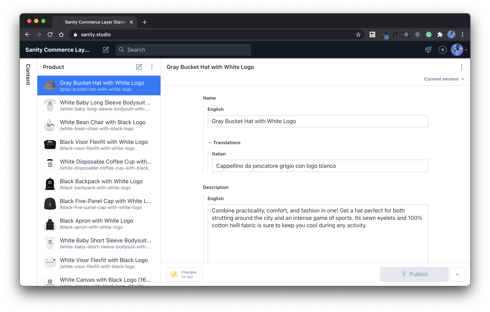
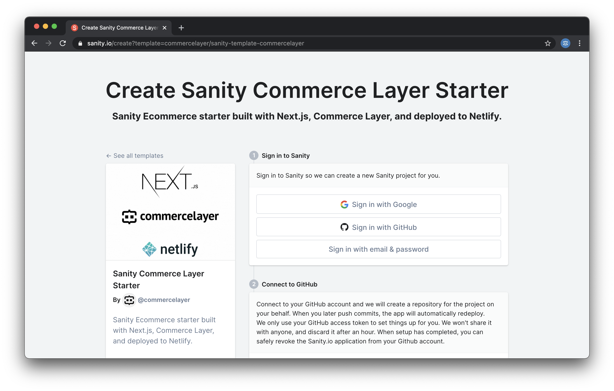

# Sanity Commerce Layer Starter

An ecommerce starter that features the sanity studio built with Next.js, Commerce Layer, and deployed to Netlify.




## What is Commerce Layer?

[Commerce Layer](https://commercelayer.io) is a headless commerce platform and order management system that lets you add global shopping capabilities to any website, mobile app, chatbot, or IoT device, with ease. Perfect fit for the best-of-breed CMSs, static site generators, and any other tools you already master and love, our blazing-fast and secure API will help you make your content shoppable on a global scale.

## Getting started

The quickest way to get up and running is to go to https://www.sanity.io/create?template=commercelayer/sanity-template-commercelayer and create a new project by following the instructions on Sanity.



### Installation guide

1. Clone this repository ([learn how to do it](https://docs.github.com/en/github/creating-cloning-and-archiving-repositories/cloning-a-repository)).

2. Rename `.env.example` to `.env` and add the following:

- Your project ID and token from [manage.sanity.io](https://manage.sanity.io).
- Your client ID and client endpoint from [Commerce Layer](https://core.commercelayer.io/users/sign_up).

3. Install the necessary dependencies:

```bash
npm install
```

### Run frontend locally

1. Build template files to the `./build` directory.

```bash
npm run dev
```

This will build both `web` and `studio` files.

2. Install the necessary dependencies for Nextjs.

```bash
cd build/web && npm install
```

3. Start the development server in `./build/web`.

```bash
npm run dev
```

This will run the frontend at `localhost:3000`

### Run studio locally

1. Install the necessary dependencies for Sanity Studio.

```bash
cd build/studio && sanity install
```

2. Add your project `name`, `projectId,` and `dataset` in `./template-values-dev.json`.

3. Start the development server `./build/web`.

```bash
npm run dev
```

This will run the studio at `localhost:3333`

## Contributors guide

1. Fork this repository ([learn how to do it](https://help.github.com/articles/fork-a-repo)).

2. Clone the forked repository like so:

```bash
git clone https://github.com/<your username>/sanity-template-commercelayer.git && cd sanity-template-commercelayer
```

3. Make your changes and create a pull request ([learn how to do it](https://docs.github.com/en/github/collaborating-with-issues-and-pull-requests/creating-a-pull-request)).

## Need help?

1. Request an invite to join [Commerce Layer's Slack community](https://slack.sanity.io).

2. Create an [issue](https://github.com/commercelayer/sanity-template-commercelayer/issues) in this repository.

3. Ping us [on Twitter](https://twitter.com/commercelayer).

---

Want to learn more about how we built this starter and how you can build yours? Sign up for our [newsletter](https://commercelayer.io) to get notified once we publish the article.